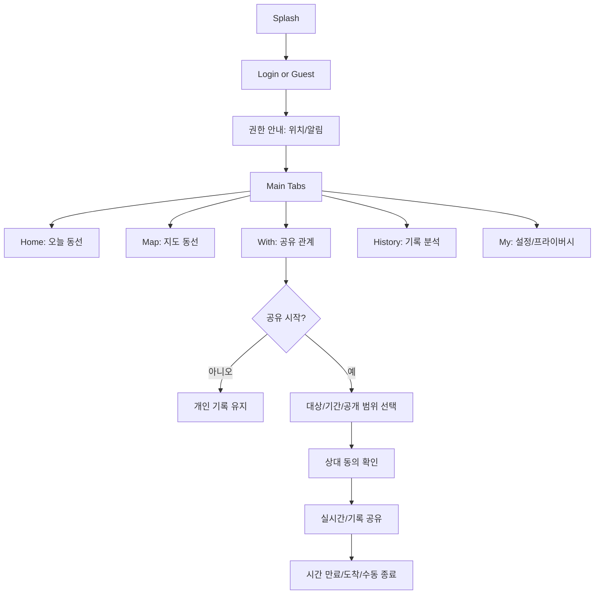
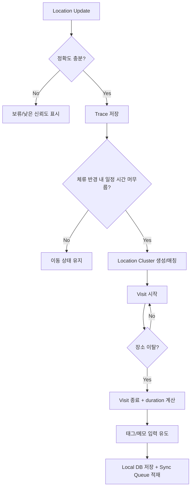
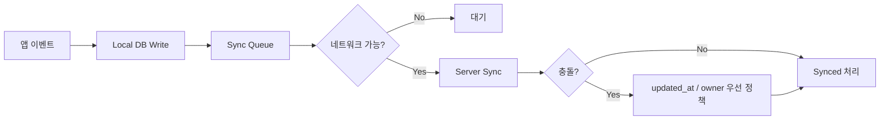
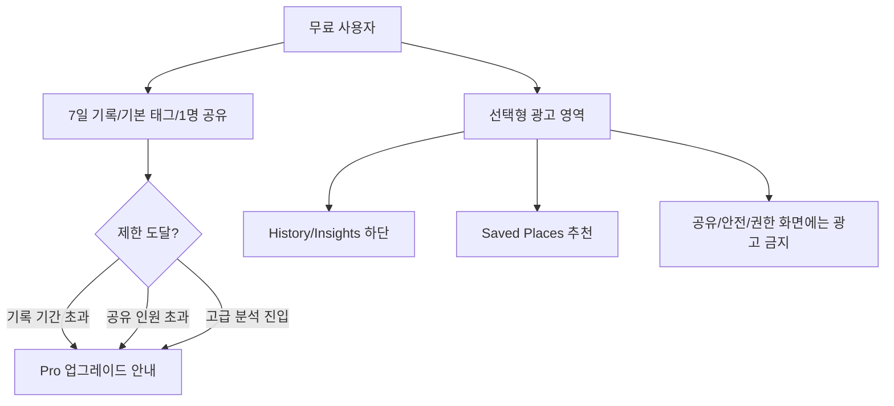

# WithPath Mermaid Flowcharts v2

## 1. 전체 앱 흐름

```mermaid
flowchart TD
  A[Splash] --> B[Login or Guest]
  B --> C[권한 안내: 위치/알림]
  C --> D[Main Tabs]
  D --> H[Home: 오늘 동선]
  D --> M[Map: 지도 동선]
  D --> W[With: 공유 관계]
  D --> R[History: 기록 분석]
  D --> S[My: 설정/프라이버시]
  W --> Q{공유 시작?}
  Q -- 아니오 --> P[개인 기록 유지]
  Q -- 예 --> T[대상/기간/공개 범위 선택]
  T --> U[상대 동의 확인]
  U --> V[실시간/기록 공유]
  V --> X[시간 만료/도착/수동 종료]
```

## 2. 위치 기록 로직

```mermaid
flowchart TD
  A[Location Update] --> B{정확도 충분?}
  B -- No --> C[보류/낮은 신뢰도 표시]
  B -- Yes --> D[Trace 저장]
  D --> E{체류 반경 내 일정 시간 머무름?}
  E -- No --> F[이동 상태 유지]
  E -- Yes --> G[Location Cluster 생성/매칭]
  G --> H[Visit 시작]
  H --> I{장소 이탈?}
  I -- No --> H
  I -- Yes --> J[Visit 종료 + duration 계산]
  J --> K[태그/메모 입력 유도]
  K --> L[Local DB 저장 + Sync Queue 적재]
```

## 3. Local DB & Sync

```mermaid
flowchart LR
  A[앱 이벤트] --> B[Local DB Write]
  B --> C[Sync Queue]
  C --> D{네트워크 가능?}
  D -- No --> E[대기]
  D -- Yes --> F[Server Sync]
  F --> G{충돌?}
  G -- Yes --> H[updated_at / owner 우선 정책]
  G -- No --> I[Synced 처리]
  H --> I
```

## 4. 과금/광고 노출 위치

```mermaid
flowchart TD
  A[무료 사용자] --> B[7일 기록/기본 태그/1명 공유]
  B --> C{제한 도달?}
  C -- 기록 기간 초과 --> D[Pro 업그레이드 안내]
  C -- 공유 인원 초과 --> D
  C -- 고급 분석 진입 --> D
  A --> E[선택형 광고 영역]
  E --> F[History/Insights 하단]
  E --> G[Saved Places 추천]
  E --> H[공유/안전/권한 화면에는 광고 금지]
```
